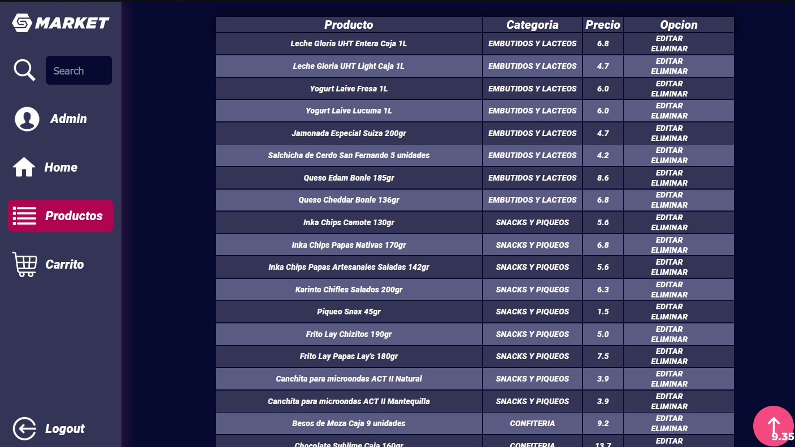
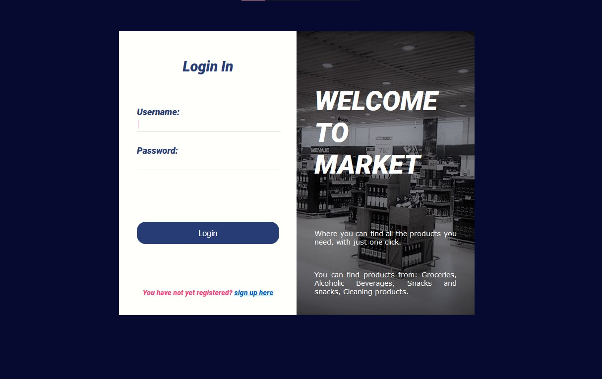
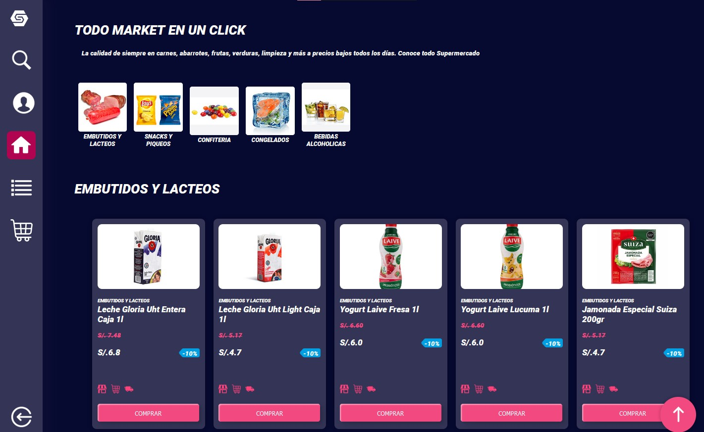
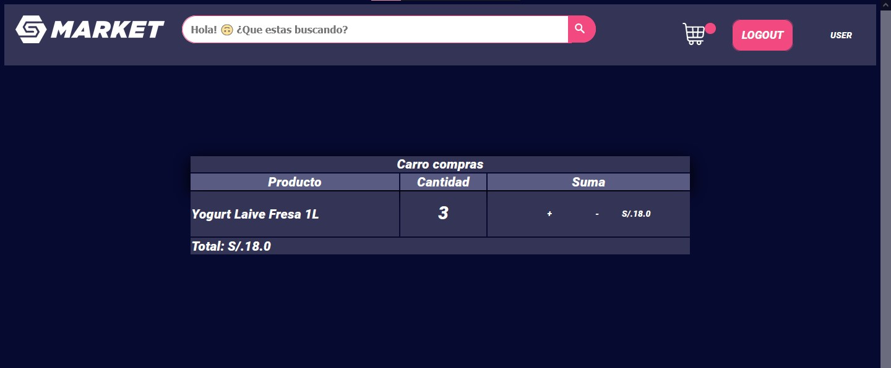

<br />
<div align="center" id="top">
  <a href="https://github.com/othneildrew/Best-README-Template">
    
  </a>
    <br>
    <br>
  <h3 align="center">Full Stack Ecommerce website usando el framework django y sqlite3.</h3>

  <p align="center">
    <br />
    <a href="#contenido"><strong>Tabla de contenidos »</strong></a>
    <br />
    <br />
  </p>
</div>

<details>
  <summary id="contenido">Tabla de contenidos</summary>
  <ol>
    <li>
      <a href="#sobre-el-proyecto">Sobre el Proyecto</a>
    </li>
    <li>
      <a href="#ejecutar-localmente">Ejecutar localmente 🚀</a>
    </li>
    <li>
      <a href="#construido-con">Construido Con</a>
    </li>
    <li>
      <a href="#screenshots">Screenshots</a>
    </li>
  </ol>
</details>
<br>
<br>

## Sobre el proyecto

<br>
<br>
Este proyecto es el paso que marcó definitivamente mi inclinación hacia el desarrollo web y al framework django, la versatilidad y la abstracción de ciertos procesos repetitivos me dio la clara idea de que simplemente adoro django.

Como resultado tenemos dos UIs (interfaces de usuario) distintivas para el administrador y usuario, un carrito de compras las herramientas de administración necesarias para este caso de uso.
<p align="right">(<a href="#top">ir al inicio</a>)</p>
<hr>

## Ejecutar localmente
### **Prerequisitos**
Se recomienda instalar las dependencias del proyecto dentro de un <a href="https://pythonbasics.org/virtualenv/">virtual environment</a>.
Para instalar el modulo de python para la administracion de virtual environments globalmente ejecute.
```
pip install virtualenv
```

1. Clonar el repositorio.
```
    git clone https://github.com/Jamir-boop/market-django.git
```
2. Crear un virtual environment (el siguiente commando creará uno con el nombre de "env").
```
    virtualenv env
```
3. Para activar el env
```
    .\env\Scripts\activate
```
4. Instalar dependencias dentro del virtual env. (Asegurarse de estar al mismo nivel del archivo `requirements.txt`)
```
    pip install -r .\requirements.txt
```
5. Ingresar al nivel donde se encuentra el archivo `manage.py` e iniciar el servidor locamente.
```
    python ./manage.py runserver
```
Cuentas demostrativas:
| Usuario | Clave |           Rol |
| ------- | :---: | ------------: |
| admin   | 1234  | administrador |
| user    | 1234  |       usuario |

<p align="right">(<a href="#top">ir al inicio</a>)</p>
<hr>

## Construido con
-   Python
-   [Django](https://www.djangoproject.com/)
-   Javascript
-   HTML
-   CSS
<hr>

## Screenshots

<br>
<br>

<br>
<br>

<p align="right">(<a href="#top">ir al inicio</a>)</p>
